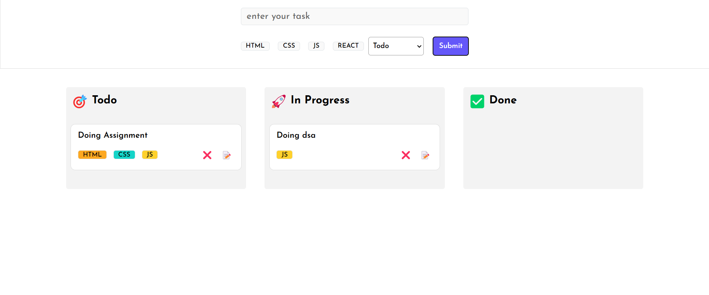

Simple Kanaban Board Assignment

Properties :

1. Create task.
2. Update task.
3. Delete task.
4. Uses Local Storage.
5. External styles.
6. No external libraries.

Usage :- 

1. git clone https://github.com/AbbasGawali/reactkanabanboard
2. npm install
3. npm run dev

Done 
